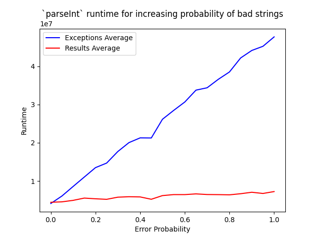

```
      ███                                    ███    ██████             ███  
     ░░░                                    ███    ███░░███           ░░███ 
     █████  ██████   █████ █████  ██████   ███    ░███ ░░░  ████████   ░░███
    ░░███  ░░░░░███ ░░███ ░░███  ░░░░░███ ░███   ███████   ░░███░░███   ░███
     ░███   ███████  ░███  ░███   ███████ ░███  ░░░███░     ░███ ░███   ░███
     ░███  ███░░███  ░░███ ███   ███░░███ ░░███   ░███      ░███ ░███   ███ 
     ░███ ░░████████  ░░█████   ░░████████ ░░███  █████     ████ █████ ██░  
     ░███  ░░░░░░░░    ░░░░░     ░░░░░░░░   ░░░  ░░░░░     ░░░░ ░░░░░ ░░░   
 ███ ░███                                                                   
░░██████                                                                    
 ░░░░░░                                                                     
```

`java(fn)` is a lightweight library (on the order of hundreds of kb) with no dependencies, which adds a few additional functional tools to the java language, most notably a `Result` class for error handling without exceptions and a set of tuples that allow better readability in streams.

## Result and Either

The `Result` class is an algebraic type that represents the possibly unsuccessful result of an operation.  Similar to an `Either` in many languages, a `Result` wraps a value of type ERR or of type OK, but never both.  `null` is a valid value, but the Result will either be an err or an ok, and the other value will be empty (similar to Optional.empty()).

```java
Try.get(() -> new URL(theUrl))                                // Result<Exception, URL>
    .asOk().flatMap(Try.Map(URL::openConnection))             // Result<Exception, Connection>
    .asOk().flatMap(Try.Map(URLConnection::getInputStream))   // Result<Exception, InputStream>
    .asOk().map(is -> new BufferedReader(new InputStreamReader(is)))  // Result<Exception, BufferedReader>
    .asOk().map(BufferedReader::lines)                        // Result<Exception, Stream<String>>
    .asErr().peek(ex -> System.err.println("An exception occurred trying to fetch the url."))
    .asErr().peek(Exception::printStackTrace)
    .asOk().opt()                                              // Optional<Stream<String>>
    .ifPresent(lines -> System.out.println("URL contents from demoResult: " + lines.collect(Collectors.joining("\n"))));

```

See more demo code [in the source tree](./src/test/java/org/javafn/demo).

Check out the [benchmark](./src/test/java/org/javafn/bench/ExceptionVsResult.java) that compares the `Integer.parseInt` function with an equivilent function that returns a `Result`.  Notice that as the number of errors increases, so too does the runtime for the code that throws exceptions.  On the other hand, the same function that returns a Result shows virtually no increase in runtime as the number of errors increase.



The syntax and usage of the Result class is heavily inspired by [Rust's Result type](https://doc.rust-lang.org/std/result/) and [Scala's Either type](https://www.scala-lang.org/api/2.12.11/scala/util/Either.html) (prior to v2.13).

`java(fn)` also includes an `Either` class with many similar features.  The distinction is about semantics.  To a new Java developer unfamiliar with Haskell, "Result" conveys more meaning then "Either", and "asErr"/"asOk" is more intuitive than "asLeft"/"asRight".  `Either` is included because sometimes you don't want to apply "err/ok" semantics.  Rather you want to convey that a piece of data may be represented in one of two types, both equally valid.

Sometimes you don't want to build a long pipeline.  If you get an error from an intermediate function, you want to return it immediately and proceed with the rest of your code.  Rust has the `?` operator, for which there is no java equivalent.

```rust
fn do_thing() -> Result<OkType, ErrType> {
  let intermediate = get_intermediate()?
  Ok(intermediate.genOkType())
}
```

The following is our proposed usage pattern.

```java
public Result<ErrType, OkType> do_thing() {
  final Foo intermediate;
  {
    final Result<ErrType, Foo> res = get_intermediate();
    if (res.isErr) return res.asErr().into();
    intermediate = res.asOk().get();
  }
  return Result.ok(intermediate.genOkType());
```

Notice that we handle the intermediate result in a scope block so the variable `res` lives a short life.  If the result is an error, we want to return it, but the type is not correct.  We have a `Result<ErrType, Foo>` but we need a `Result<ErrType, OkType>`, and the `into()` function on the error projection allows us to safely change the signature.  If the result is an ok, we get the intermediate result, assign it outside of the scope block and proceed to use it.  Unfortunately, there's no way to get around storing the result in a variable because there's no way to conditionally return in a single statement.  Of course, you could continue operating on the Result by chaining `asOk()....` calls, but this is not always the best approach.

## Try

The `Try` class can be used in streams to perform an operation that would normally throw an exception (which is not allowed in streams) and returns a `Result` instead.  In the following example, `sum` will be `-1` if there are _any_ errors.  Otherwise, it will be the sum of all the user-supplied numbers.

```java
final List<String> userSuppliedNumbers = ...;
final long sum = userSuppliedNumbers.stream()      // Stream<String>
        .map(Try.Map(Long::parseLong))             // Stream<Result<Exception, Long>>
        .map(Ok.MapToLong(i -> i))                 // Stream<LongResult<Exception>>
        .collect(LongResult.collector())           // LongResultCollection<Exception>
        .fold()                                    // LongResult<List<Exception>>
        .reduce(
                errs -> -1L,
                oks -> Arrays.stream(oks).sum()
        );
```

The only major limitation here is that we can't specify which exceptions we're interested in.  We can't be generic over the types we catch, therefore, the implementation for all functions wraps the call in a `...catch (final Exception x) ...` block that returns the caught exception as an Err.  We _could_ try to catch implementations of `Throwable`, but these are usually a sign that something major is wrong and shouldn't be handled by user code.  We could also accept a `Class` object, then in the catch, test if the caught exception is the one you're interested in and rethrow it otherwise.  This seems like a poor design choice.  Therefore, if you use the methods in `Try`, you will get a Result wrapping any Exception caught.

## Tuples

`java(fn)` offers tuples similar to the Pair, Triplet, and Quartet type in [javatuples](https://www.javatuples.org/) that supports better fluent functional usage.  These are named `Pair`, `Trio`, and `Quad`.  We did not add tuples of 5 or more because we had to draw the line somewhere.

Compare

```java
IntStream.range(0, 10).mapToObj(i -> org.javatuples.Pair.with(i, i*2))
    .filter(pair -> pair.getValue0() % 2 == 0)
    .map(pair -> pair.getValue0() + pair.getValue1())
    .forEach(System.out::println);
```

versus

```java
IntStream.range(0, 10).mapToObj(i -> Pair.of(i, i*2))
    .filter(pair -> pair.filter1(i -> i % 2 == 0)
    .map(pair -> pair.map( (l, r) -> l + r))
    .forEach(System.out::println);
```

and even better

```java
IntStream.range(0, 10).mapToObj(i -> Pair.of(i, i*2))
    .filter(Pair.Filter1(i -> i % 2 == 0)
    .map(Pair.Map( (l, r) -> l + r))
    .forEach(System.out::println);
```

Notice that you get to name the parameters you're interested in, similar to destructuring in languages that support pattern matching.  `java(fn)`'s tuples contain two versions of most functions, lowercase methods and uppercase static methods.  The lowercase methods operate directly on the tuple, while the uppercase methods return a function that accepts a pair and operates on that.  The latter are useful in streams to avoid creating a variable named `pair` just to call a function on it.  The methods must be named differently because java can't have static and member functions with the same name.

```java
stream.map(pair -> pair.map( (l, r) -> ...));
stream.map(Pair.Map( (l, r) -> ...));
```

The `Trio` and `Quad` classes are similar to `Pair` but are not documented so we don't run the risk of them getting out of sync.  Refer to the documentation for `Pair` for all three tuples.

Another feature of the tuples is the ability to create chunks and sliding windows over arrays.

## Idx

Sometimes we need to enumerate the items in a stream, for example, if you have a list (with a known size) and you want to provide a completion percentage.  This tuple behaves similar to a Pair, except that the first element is a primative int, and each element in the stream receives an increasing value from 0.

Similar to [Rust's enumerate](https://doc.rust-lang.org/std/iter/trait.Iterator.html#method.enumerate) or [Python's enumerate](https://docs.python.org/3/library/functions.html#enumerate).

```java
someStream.map(Idx.enumerate())
     .peek(Idx.Peek( (i, item) -> println("Completing item " + i ))
     ...;
```

or equivalently,

```java
Idx.enumerate(someStream)
     .peek(Idx.Peek( (i, item) -> println("Completing item " + i ))
     ...;
```

The former is useful for inserting into an existing stream, for example, following some filter functions.

## Using

Simply include the dependency in your build tool, for example, using maven

```xml
<dependency>
    <groupId>org.javafn</groupId>
    <artifactId>javafn</artifactId>
    <version>1.0.1</version>
</dependency>
```

or gradle

```gradle
implementation 'org.javafn:javafn:1.0.1'
```

## Compatibility

This library is in use in several production projects that are frozen at Java 8 until RedHat drops support in favor of a newer Java version.  Therefore, this library must always be bytecode compatible with Java 8.  It should support newer versions with no modifications (I have used it for small projects using Java 17, but have done no major testing).  

Future versions will not be backwards compatible with any versions in the 1.x series.  Hopefully, we'll iron out some of our naming schemes (e.g., `pair._1` comes from scala and isn't idiomatic java) and arrive at a stable API.  Regardless, we will adhere to semantic versioning.

## Contact

Contact us by email `org.javafn`at`javafn.org` or create a ticket in this repo's issues.
